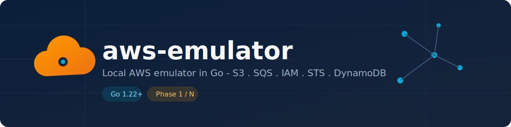

# aws-emulator



Local AWS emulator in Go, sibling to [azure-emulator](../azure-emulator) and
[gcp-emulator](../gcp-emulator), built for development and integration
testing without depending on a real AWS account or Docker.

Replaces [`ministack`](./ministack) (the Python version of this same
project, kept as a historical reference and for comparing service
coverage) — see the rewrite decision in
[ministack/CLEANUP.md](./ministack/CLEANUP.md).

## Why this differs from azure-emulator/gcp-emulator

Azure and GCP route by hierarchical path (one logical host per service,
nested REST routes). AWS multiplexes dozens of services over a **single
endpoint** — typically port `4566`, same as LocalStack — and distinguishes
the target service through a combination of signals: the `X-Amz-Target`
header, the credential scope in the `Authorization` header, the `Action`
parameter, the `Host` header, or the path. That routing logic lives in
[`internal/router`](./internal/router) and is the most distinctive piece of
this project compared to its siblings.

## Implemented services (Phase 1)

| Service | Protocol | Operations |
|---|---|---|
| S3 | Query/XML | buckets and objects: create/list/delete bucket, put/get/head/delete object |
| SQS | Query/XML | queues and messages: create/list/get-url/delete/purge queue, send/receive/delete message |
| IAM | Query/XML | roles: create/get/list/delete role |
| STS | Query/XML | GetCallerIdentity |
| DynamoDB | JSON 1.0 | tables and items: create/describe/delete table, put/get/delete item, scan (Query is handled as scan) |

The rest of the ~50 AWS services (Lambda, API Gateway, EventBridge, etc.)
are left for future phases — see [ROADMAP.md](./ROADMAP.md).

## Usage

```bash
go run ./cmd/aws-emulator -addr :4566 -db .aws-emulator-data/state.db
```

Point the AWS SDK/CLI at the emulator (any credentials work, the signature
is not validated):

```bash
export AWS_ACCESS_KEY_ID=test
export AWS_SECRET_ACCESS_KEY=test
export AWS_DEFAULT_REGION=us-east-1
aws --endpoint-url http://localhost:4566 s3 mb s3://my-bucket
aws --endpoint-url http://localhost:4566 s3 ls
```

Admin endpoints:

- `GET /_aws-emulator/health` — health check.
- `POST /_aws-emulator/reset` — not yet enabled (see ROADMAP.md).

## Development

```bash
go build ./...
go vet ./...
go test ./... -v -race
```

## Persistence

State is embedded in BoltDB (`go.etcd.io/bbolt`), a single file
(`.aws-emulator-data/state.db` by default). No external dependencies: no
Postgres or Docker required to run the emulator.
